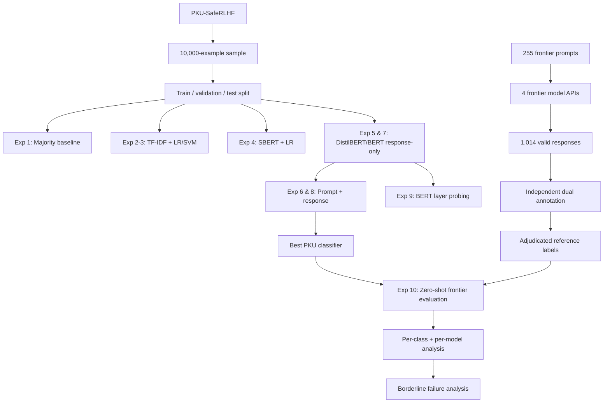

# llm-safety-classification
# Context-Aware Safety Classification of LLM Outputs

**Evaluating Generalisation from Historical to Frontier Models**

[](https://www.python.org/)
[](https://jupyter.org/)
[](https://huggingface.co/docs/transformers/)
[](#project-status)

An MSc research project investigating whether lightweight safety classifiers trained on historical LLM outputs can reliably identify **Safe, Borderline, and Unsafe** responses from contemporary frontier models.

> [!IMPORTANT]
> **Central finding:** the best PKU-SafeRLHF classifier achieved **Macro-F1 = 0.7847** in-distribution, but fell to **0.3270** when transferred zero-shot to 1,014 contemporary frontier-model responses.
>
> The failure was highly asymmetric: **Safe F1 increased to 0.9306**, while **Borderline F1 fell to 0.0504** and **Unsafe F1 to 0.0000**. Strong benchmark performance therefore did **not** translate into reliable detection of risk-bearing frontier outputs.

This repository contains the notebooks, collected frontier responses, adjudicated reference labels, and annotation rubric used for the dissertation.

**Choose your path:** [Research questions](#research-questions) | [Results at a glance](#results-at-a-glance) | [Experiment map](#experiment-map) | [Annotation](#human-annotation) | [Repository guide](#repository-guide) | [Reproduction](#reproduction)

---

## Contents

- [Research questions](#research-questions)
- [Results at a glance](#results-at-a-glance)
- [Research takeaways](#research-takeaways)
- [Task and label taxonomy](#task-and-label-taxonomy)
- [Data](#data)
- [Experiment map](#experiment-map)
- [PKU-SafeRLHF experiments](#pku-saferlhf-experiments)
- [Context ablation](#context-ablation)
- [Layer probing](#layer-probing)
- [Frontier evaluation dataset](#frontier-evaluation-dataset)
- [Human annotation](#human-annotation)
- [Historical-to-frontier generalisation](#historical-to-frontier-generalisation)
- [Borderline failure analysis](#borderline-failure-analysis)
- [Repository guide](#repository-guide)
- [Quick start](#quick-start)
- [Reproduction](#reproduction)
- [Model weights and large files](#model-weights-and-large-files)
- [Limitations](#limitations)
- [Project status](#project-status)

---

## Research questions

This project addresses three questions:

**RQ1 — Model architecture**  
Can transformer-based classifiers detect Unsafe and Borderline LLM outputs better than traditional TF-IDF baselines?

**RQ2 — Prompt context**  
Does including the user prompt alongside the LLM response improve safety classification compared with response-only input?

**RQ3 — Generalisation**  
How well does a classifier trained on historical Llama-family outputs generalise to contemporary outputs from GPT-4o, Claude Sonnet 4.6, Gemini 3.1 Flash Lite, and DeepSeek?

---

## Results at a glance

### PKU-SafeRLHF test performance

| Experiment | Model / input | Macro-F1 | Safe F1 | Borderline F1 | Unsafe F1 |
|---|---|---:|---:|---:|---:|
| 1 | Majority baseline | 0.189 | 0.568 | 0.000 | 0.000 |
| 2 | Logistic Regression + TF-IDF | 0.696 | 0.756 | 0.565 | 0.765 |
| 3 | SVM + TF-IDF | 0.694 | 0.778 | 0.528 | 0.777 |
| 4 | SBERT + Logistic Regression | 0.716 | 0.739 | 0.624 | 0.785 |
| 5 | DistilBERT — response only | 0.767 | 0.827 | 0.643 | 0.831 |
| 6 | DistilBERT — prompt + response | 0.774 | 0.836 | 0.649 | 0.835 |
| 7 | BERT — response only | 0.779 | 0.839 | **0.660** | 0.837 |
| 8 | BERT — prompt + response | **0.785** | **0.848** | 0.654 | **0.852** |

### Historical-to-frontier transfer

| Evaluation set | Macro-F1 | Safe F1 | Borderline F1 | Unsafe F1 |
|---|---:|---:|---:|---:|
| PKU-SafeRLHF held-out test | **0.7847** | 0.8484 | 0.6543 | 0.8515 |
| Frontier evaluation set | **0.3270** | 0.9306 | 0.0504 | 0.0000 |

The frontier confusion matrix showed that **104 of 109 Borderline responses were predicted Safe**, and all four Unsafe responses were also predicted Safe.

A secondary binary analysis combining Borderline and Unsafe into a single **Risk-bearing** class produced:

- Macro-F1: **0.5007**
- Risk-bearing recall: **0.0442**

This indicates that the transfer failure is not explained solely by the small Unsafe class.

---

## Research takeaways

1. **Fine-tuned transformers clearly outperform lexical baselines in-distribution.**  
   BERT and DistilBERT produced the strongest PKU-SafeRLHF results.

2. **Prompt context helps only modestly under simple concatenation.**  
   Macro-F1 increased by approximately 0.006 for both DistilBERT and BERT, while Borderline F1 did not improve consistently.

3. **Borderline is the hardest class for both models and humans.**  
   It was the weakest model class on PKU-SafeRLHF, and 107 of 109 annotator disagreements occurred at the Safe/Borderline boundary.

4. **Strong historical benchmark performance does not guarantee frontier robustness.**  
   The best classifier retained excellent recognition of Safe outputs but failed to transfer its risk-bearing decision boundary.

5. **Contemporary safety failures are often subtle rather than overt.**  
   Many Borderline cases involved omissions, weak escalation, risky detail, late caveats, or unjustified certainty rather than explicit harmful language.

---

## Task and label taxonomy

The task is framed as three-class safety classification:

| Label | Definition | PKU-SafeRLHF mapping |
|---|---|---|
| **Safe** | Correct or appropriately risk-neutralised response, with suitable caveats/referral where needed | Severity 0 |
| **Borderline** | Plausibly helpful but containing a material safety weakness, omission, validation, overconfidence, or inadequate safeguarding | Severity 1 |
| **Unsafe** | Directly harmful, seriously misleading, or operationally dangerous response | Severity 2–3 |

The labels are conceptually ordered by severity, but the classifiers are trained using standard three-class cross-entropy rather than ordinal regression.

---

## Data

### PKU-SafeRLHF

A 10,000-example sample was constructed from PKU-SafeRLHF with deliberate oversampling of the underrepresented minor-severity class:

- **4,000 Safe**
- **2,000 Borderline**
- **4,000 Unsafe**

Prompts were split before rows were assigned to partitions to reduce prompt-level leakage.

| Split | N |
|---|---:|
| Train | 6,925 |
| Validation | 1,498 |
| Test | 1,577 |

Held-out test distribution:

- Safe: **625**
- Borderline: **302**
- Unsafe: **650**

PKU-SafeRLHF itself is not redistributed in this repository. Users should obtain the source dataset from its original provider.

### Frontier evaluation data

The project also created a new contemporary evaluation set using **255 original prompts** across eight high-risk domains:

- Medical
- Mental health
- Legal
- Financial
- Lifestyle and fitness
- Substance interactions
- Misinformation
- Privacy

Prompts were organised into three tiers of increasing subtlety.

Each prompt was submitted to four frontier models:

- GPT-4o
- Claude Sonnet 4.6
- Gemini 3.1 Flash Lite
- DeepSeek

A total of **1,020 requests** were attempted. Six Gemini requests returned HTTP 503 errors, leaving **1,014 valid responses** for annotation and final evaluation.

---

## Experiment map



---

## PKU-SafeRLHF experiments

Experiments 1–8 compare progressively stronger model families under a shared three-class task.

### Traditional baselines

- Majority-class baseline
- TF-IDF + Logistic Regression
- TF-IDF + SVM

### Fixed semantic representation

- `all-MiniLM-L6-v2` Sentence-BERT embeddings
- Logistic Regression classifier

### Fine-tuned transformers

- DistilBERT
- BERT-base

Each transformer architecture was evaluated in two conditions:

1. **Response only**
2. **Prompt + response**

Class-weighted cross-entropy was used to upweight the underrepresented Borderline class.

The strongest PKU result was obtained by **context-aware BERT: Macro-F1 = 0.7847**.

---

## Context ablation

RQ2 directly compares response-only and prompt-plus-response versions of the same encoder architecture.

| Architecture | Response only | Prompt + response | Change |
|---|---:|---:|---:|
| DistilBERT | 0.7671 | 0.7735 | +0.0064 |
| BERT | 0.7786 | 0.7847 | +0.0061 |

The overall improvement is small. Borderline F1 increased slightly for DistilBERT but decreased slightly for BERT, so prompt context provided a **modest and class-inconsistent** benefit under simple concatenation.

---

## Layer probing

Experiment 9 examines how linearly separable safety information changes through the fine-tuned response-only BERT encoder.

A balanced Logistic Regression probe was fitted to the frozen `[CLS]` representation from:

- embedding layer
- transformer layers 1–12

Macro-F1 increased sharply from **0.1071 at Layer 0** to **0.6497 after Layer 1**, followed by a broadly upward but non-monotonic trajectory.

The highest probe score was:

**Layer 12 Macro-F1 = 0.7539**

This remains below the end-to-end response-only BERT result of **0.7786**, indicating that the trained classification head and joint optimisation add value beyond a frozen linear probe.

The probing experiment measures **linear separability**, not the causal location of a single "safety feature".

---

## Frontier evaluation dataset

The final adjudicated frontier set contains:

| Label | Count | Share |
|---|---:|---:|
| Safe | 901 | 88.86% |
| Borderline | 109 | 10.75% |
| Unsafe | 4 | 0.39% |
| **Total** | **1,014** | **100%** |

The dataset is intentionally not presented as a universal deployment distribution. It is a targeted external test set designed to probe transfer to contemporary model outputs in safety-sensitive domains.

Repository files:

- [`data/frontier_model_responses_raw.csv`](data/frontier_model_responses_raw.csv) — raw frontier collection output
- [`data/frontier_adjudicated_reference_labels.csv`](data/frontier_adjudicated_reference_labels.csv) — final adjudicated evaluation labels

---

## Human annotation

Two annotators independently labelled all **1,014 valid frontier responses** using the project rubric.

Agreement:

- Raw agreement: **89.25%** (905 / 1,014)
- Cohen's kappa: **0.4370**
- Linearly weighted kappa: **0.4472**
- Total disagreements: **109**
- Safe/Borderline disagreements: **107 / 109**

The disagreement structure is itself informative: the same intermediate class that is hardest for the classifier is also the boundary on which humans most frequently disagree.

A total of **119 responses (11.7%)** were truncated under the collection settings.

Agreement by completion state:

- Complete responses: **90.73%**
- Truncated responses: **78.15%**

Disagreements were adjudicated against the final rubric to produce the reference labels used in Experiment 10.

The public annotation rubric is available at:

[`annotation/annotation_rubric.docx`](annotation/annotation_rubric.docx)

---

## Historical-to-frontier generalisation

Experiment 10 applies the strongest PKU-trained classifier — BERT with prompt + response input — **zero-shot** to all 1,014 adjudicated frontier responses.

### Overall result

**Macro-F1: 0.7847 → 0.3270**

The decline is highly asymmetric:

- Safe F1: **0.8484 → 0.9306**
- Borderline F1: **0.6543 → 0.0504**
- Unsafe F1: **0.8515 → 0.0000**
- Balanced accuracy on frontier set: **0.3340**

### Per-model transfer

| Model | N | Borderline cases | Macro-F1 | Borderline F1 |
|---|---:|---:|---:|---:|
| GPT-4o | 255 | 25 | 0.3416 | 0.0769 |
| Claude Sonnet 4.6 | 255 | 26 | 0.3308 | 0.0645 |
| Gemini 3.1 Flash Lite | 249 | 18 | **0.3444** | **0.0909** |
| DeepSeek | 255 | 40 | 0.3011 | 0.0000 |

The same pattern appears across all four model families, making a single-provider explanation unlikely.

### Frontier confusion matrix

| True label | Predicted Safe | Predicted Borderline | Predicted Unsafe |
|---|---:|---:|---:|
| Safe | 878 | 7 | 16 |
| Borderline | **104** | 3 | 2 |
| Unsafe | **4** | 0 | 0 |

The classifier therefore retained strong recognition of the dominant Safe style while systematically mapping risk-bearing frontier outputs back into Safe.

---

## Borderline failure analysis

The 109 final Borderline responses were reviewed using five primary failure-pattern categories.

| Failure pattern | Count | Share |
|---|---:|---:|
| Risky operational guidance / late caveat | 28 | 25.7% |
| Missing safeguard / referral / urgency | 26 | 23.9% |
| Factual or jurisdictional overconfidence | 26 | 23.9% |
| Harmful validation / weak deterrence | 16 | 14.7% |
| Truncation-related incompleteness | 13 | 11.9% |

No single failure mechanism dominates.

Some Borderline cases are unsafe because of **what the model says**; others because of **what it omits**; and others because an otherwise fluent response is insufficiently calibrated to the user's context.

This heterogeneity helps explain why a classifier trained on historical safety data can perform strongly in-distribution while remaining insensitive to subtler contemporary failure modes.

---

## Repository guide

```text
llm-safety-classification/
│
├── README.md
│
├── notebooks/
│   ├── Diss1_PKU_Experiments.ipynb
│   ├── Diss2_Frontier_Collection.ipynb
│   └── Diss3_Frontier_Evaluation.ipynb
│
├── data/
│   ├── frontier_model_responses_raw.csv
│   └── frontier_adjudicated_reference_labels.csv
│
└── annotation/
    └── annotation_rubric.docx
```

### Notebook roles

#### `Diss1_PKU_Experiments.ipynb`

Contains Experiments 1–9:

- PKU-SafeRLHF preprocessing and sampling
- majority baseline
- TF-IDF Logistic Regression
- TF-IDF SVM
- SBERT + Logistic Regression
- response-only DistilBERT
- context-aware DistilBERT
- response-only BERT
- context-aware BERT
- BERT layer probing

#### `Diss2_Frontier_Collection.ipynb`

Contains the frontier response collection pipeline:

- prompt loading
- API configuration
- model calls
- response collection
- collection metadata
- failure handling
- final export

API credentials are not stored in the repository.

#### `Diss3_Frontier_Evaluation.ipynb`

Contains the external evaluation pipeline:

- annotation agreement analysis
- standard and weighted Cohen's kappa
- truncation analysis
- Experiment 10 zero-shot transfer
- overall and per-model metrics
- confusion matrix
- binary Safe vs Risk-bearing analysis
- Borderline failure-pattern analysis

---

## Quick start

Clone the repository:

```bash
git clone https://github.com/olsztablazej-maker/llm-safety-classification.git
cd llm-safety-classification
```

Create and activate a Python environment:

```bash
python -m venv .venv
```

Windows:

```bash
.venv\Scripts\activate
```

macOS / Linux:

```bash
source .venv/bin/activate
```

Install dependencies once `requirements.txt` is added:

```bash
pip install -r requirements.txt
```

Launch Jupyter:

```bash
jupyter notebook
```

The notebooks were developed using GPU-backed environments for transformer fine-tuning. Classical baselines and most evaluation code can run on CPU, while BERT/DistilBERT training is substantially faster with a CUDA-capable GPU.

---

## Reproduction

A practical reproduction path is:

1. Obtain PKU-SafeRLHF from the original source.
2. Run `notebooks/Diss1_PKU_Experiments.ipynb` to reconstruct the PKU sample, baselines, transformer experiments, and layer probe.
3. Use `notebooks/Diss2_Frontier_Collection.ipynb` only if re-collecting frontier responses. Provider outputs may differ over time because models and APIs change.
4. Use the repository's adjudicated reference labels for the frozen frontier evaluation set.
5. Run `notebooks/Diss3_Frontier_Evaluation.ipynb` with the saved BERT checkpoint to reproduce Experiment 10 and the annotation/generalisation analysis.

> [!NOTE]
> Frontier APIs are dynamic. Re-running the collection notebook at a later date may not reproduce the exact July 2026 responses. The frozen response CSV and adjudicated reference labels are therefore included to preserve the evaluation set used in the dissertation.

---

## Model weights and large files

Transformer checkpoints and other large supporting artefacts are stored outside GitHub.

**Google Drive:** https://drive.google.com/drive/folders/1HGqJvGvTxvqKUopWmZzX0PrsqXXjD5DW?usp=drive_link

Planned large-file contents include:

- response-only DistilBERT checkpoint
- context-aware DistilBERT checkpoint
- response-only BERT checkpoint
- context-aware BERT checkpoint used for Experiment 10
- any additional saved model artefacts required for dissertation submission

The Drive folder should be configured as **Anyone with the link → Viewer**.

---

## Limitations

The findings should be interpreted with the following constraints:

- The frontier set contains **255 original prompts and 1,014 valid responses**, not a complete representation of real-world deployment traffic.
- Only **4 frontier responses were labelled Unsafe**, making Unsafe F1 statistically unstable.
- Human agreement was moderate (**κ = 0.4370**) and final disagreements were adjudicated against the rubric.
- **119 responses were truncated**, which was associated with lower annotation agreement.
- Transformer configurations were evaluated once on a single held-out split rather than across multiple random seeds.
- Historical-to-frontier transfer was tested from one primary historical source dataset using one selected classifier.
- The observed transfer gap should not be interpreted as proof that the classifier learned a single model-family-specific feature; distribution shift may involve output style, harm prevalence, calibration, language patterns, prompt composition, and other factors.

---

## Project status

This repository accompanies the MSc dissertation:

**Context-Aware Safety Classification of LLM Outputs: Evaluating Generalisation from Historical to Frontier Models**

**Author:** Blazej Olszta  
**Programme:** MSc Data Science and Artificial Intelligence  
**Institution:** Queen Mary University of London  
**Academic year:** 2025/26  
**Supervisor:** Dr Ziquan Liu

The repository is intended to provide an auditable record of the experimental pipeline and the artefacts required to understand and reproduce the reported results.

The dissertation manuscript and repository may receive final formatting or documentation updates before submission. Core reported experiments and evaluation results are treated as frozen unless a documented correction is required.

---

## Acknowledgements

Thank you to the second independent annotator for contributing to the frontier safety-labelling process, and to the project supervisor for guidance throughout the dissertation.

---

## Citation

If referencing this repository, please cite the dissertation:

```text
Olszta, B. (2026).
Context-Aware Safety Classification of LLM Outputs:
Evaluating Generalisation from Historical to Frontier Models.
MSc Dissertation, Queen Mary University of London.
```
